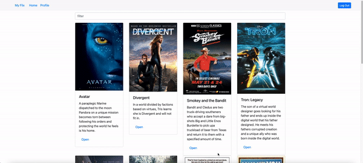

# myFlix-client

Objective
To build the server-side component of a “movies” web application. The web
application will provide users with access to information about different
movies, directors, and genres. Users will be able to sign up, update their
personal information, and create a list of their favorite movies.

Installed Parcel through Node.js
Installed React.js

This is the Client-Sie of the app.
